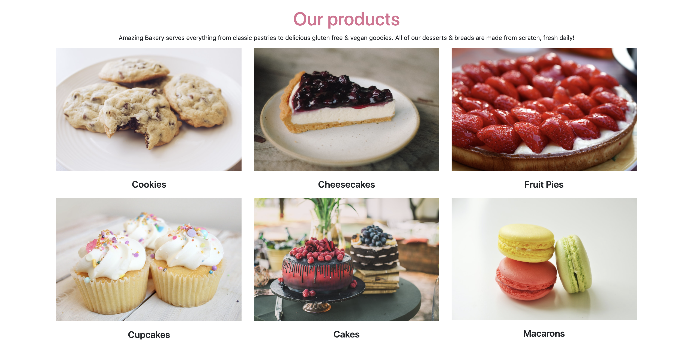
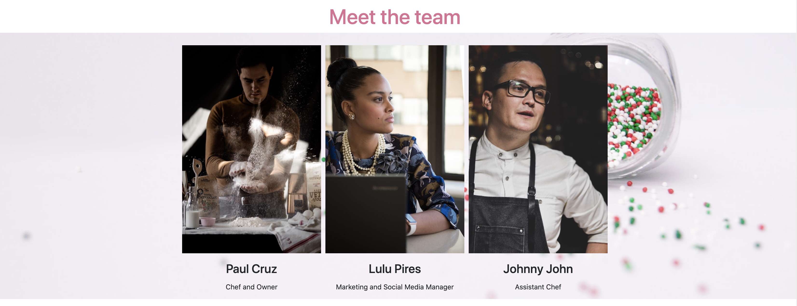
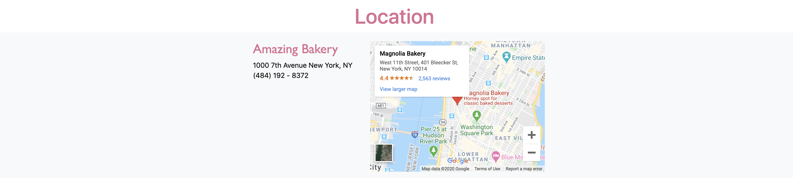

## Amazing Bakery

In this project, I've built my own bakery shop landing page using flexbox.

**amazing bakery** ​is a responsive design project by [codeacademy](https://www.codecademy.com/).

This is the [example site](https://codecademy-content.s3.amazonaws.com/PRO/independent-practice-projects/flexbox-business-site/example-site/index.html) for inspiration that [codeacademy](https://www.codecademy.com/) provided.

#### Languages
 * HTML
 * JavaScript
 * CSS

 #### CSS framework
 * Bootstrap 4.5

#### Images

